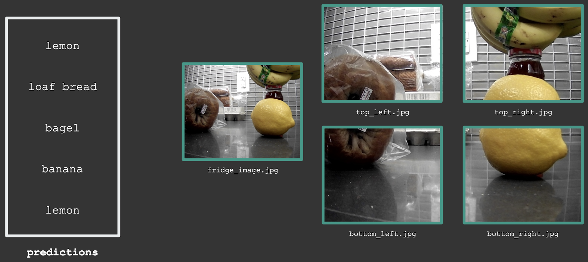
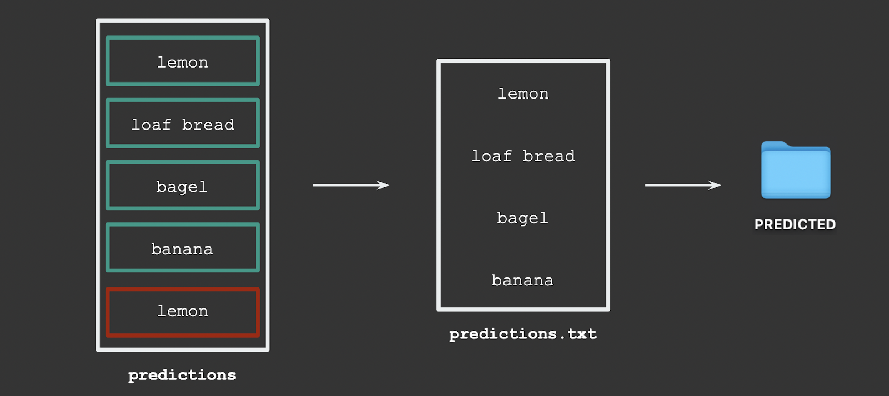
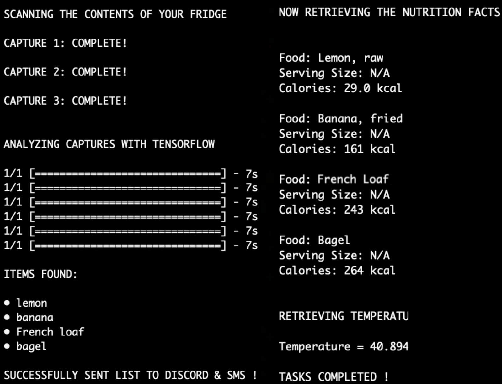
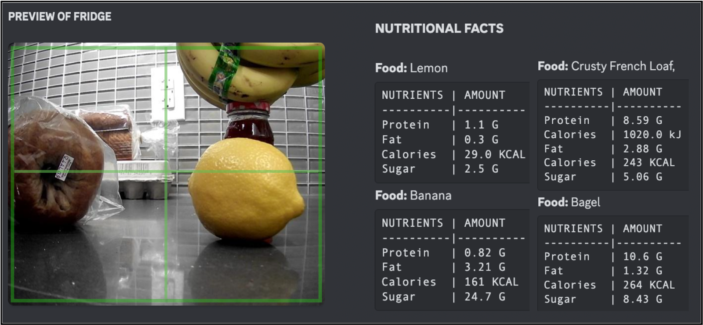
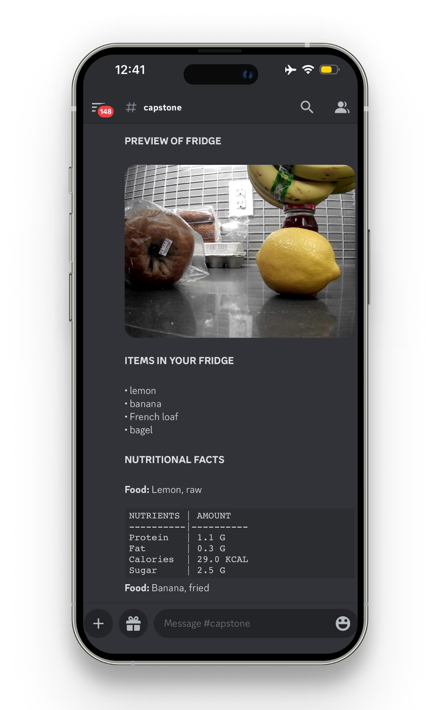
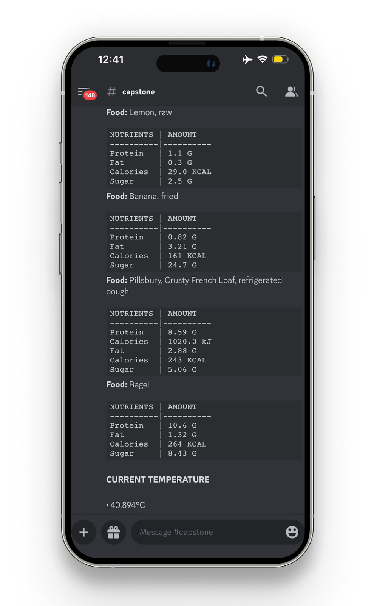

# Smart-Refrigerator

In today's fast-paced society, many people are forced to replace their perfectly functional and modern refrigerators for cosmetic and technological upgrades to keep up with the latest tech. This results in the unnecessary disposal of appliances that contribute to environmental pollution and waste. To address this issue, the project aims to bring the benefits of a smart fridge to those who own refrigerators that lack these features, by developing an affordable module using open-source software. By installing this module, users can enjoy the benefits of a smart fridge without the need to purchase a brand new one. This not only reduces e-waste and minimizes environmental impact but also saves users money in the long run. The module includes an innovative object detection system that scans and identifies the contents of a fridge with minimal cost and without requiring a new smart fridge. By preventing food waste and providing access to necessary information, the module helps users save time and money, while minimizing their environmental footprint.This project aims to create a fridge add-on that leverages computer vision to provide users with a more convenient and efficient experience. Specifically, when a user places a food item in the fridge, a webcam will capture an image of the fridge interior and use trained models to identify the newly added item, sending a notification to the user's device. Additionally, the user will be able to remotely access an entire inventory of items in their fridge, complete with suggested recipes based on those ingredients and possible expiration dates. The ultimate aim is to improve users' kitchen management and reduce food waste while creating a cost-effective and accessible solution that can be easily installed on any refrigerator.

